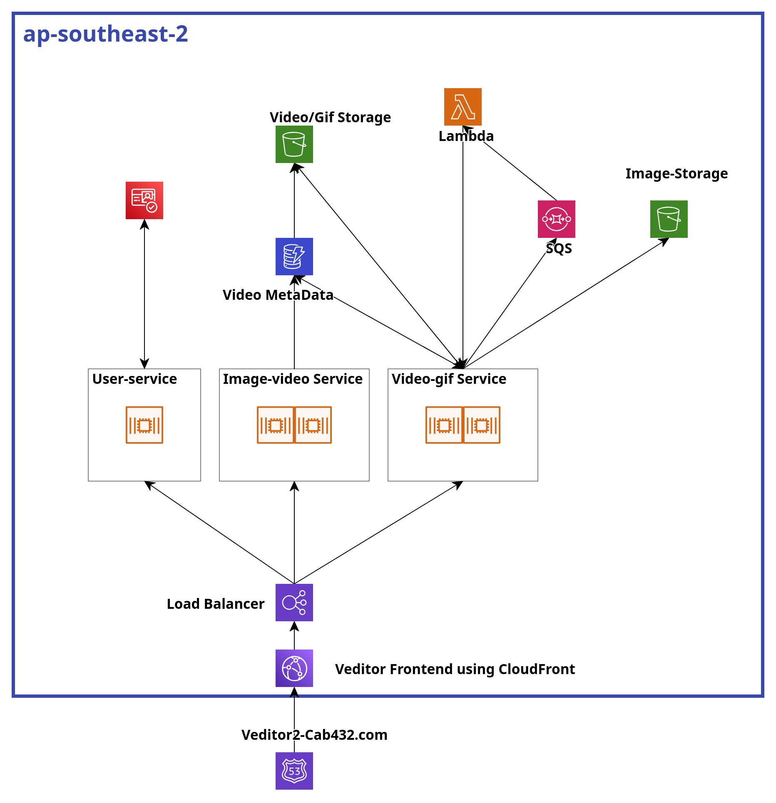

# VEDITOR
This application leverages AWS Cognito with multifactor authentication to secure user access and allow users the function to convert photos into a video slideshow. Additionally, premium users get access to a video to gif converter. Users can see their creations in the gallery and save them to their device. 

## Tech Stack
- Docker
- ReactJS
- ExpressJs
- AWS-S3
- AWS-DynamoDb
- AWS-cognito
- AWS-lambda
- AWS-CloudFront
- AWS-Elastic Container Service(ECS)
- AWS-Simple Queue Service(SQS)

## Features
- Multifactor Authentication
- Video to gif converter
- Image to video converter
- Gallery

## Architecture
The application is divided into 3 microservices for the backend API. These are:

**User-Service:** This microservice handles user authentication and user related actions. Separating it allows for easy management and potential integration with AWS cognito for MFA and secure authentication flows with other microservices. Additionally, any new microservices added do not need to build their own authentication system. They can just leverage the User-Service microservice. 

**Image-Video Service:** This service is responsible for creating videos from images. This separation isolates image handling and video generation tasks, which makes it easier to scale up using ECS. As it is a CPU intensive task, separating it also lightens the load from other functions of the application.

**Video-GIF Service:** This microservice is dedicated to converting videos to GIFs, a premium feature. By separating it, the service can independently scale to handle resource-intensive tasks, focusing on user-specific requests. As it is an additional functionality, more features can be added to it later without having any effect on the other core functions of the system.

**Compute Choices:** 
ECS was used to run the primary microservices (User, Image-Video, and Video-GIF service). ECS was chosen because of its ease of use in deployment using versioning system and efficiency in handling containerized application. As we have CPU intensive tasks in handling video ECS’s easy scaling functionality was essential for our use case. 

**Communication Mechanisms and Load Distribution**
We used SQS to offload some of the traffic of our CPU intensive task in creating a video from images. By doing so we managed to handle concurrent users efficiently and have a system to deal with our issue of video conversion taking a long time. 
We used lambda for communicating SQS with our backend API as lambda had built in functionality of event tracking of SQS.
And finally, a load balancer is used to route traffic to the three microservices that we have allowing us to horizontally scale in ECS. By combining both we get SQS handling reliable and scalable messaging between services, essential for handling bursts in requests or tasks. And the Load Balancer supports dynamic scaling of containerized services in ECS, improving resource utilization and handling peak loads.

